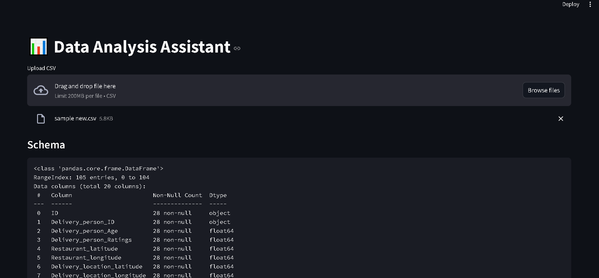

# 📊 Data Analysis Assistant with AI-Powered Insights



A Streamlit-based web application for **automatic exploratory data analysis (EDA)**, powered by **Google Gemini AI**. Upload your CSV files, and let the app:
- Summarize your dataset
- Generate an AI-powered analysis plan
- Create insightful visualizations
- Provide AI interpretations of both the data and charts (via multimodal AI)

---

## 🚀 Features

- 📁 **Dataset Overview**: Displays schema, head preview, and missing value summary.
- 🤖 **AI-Generated Analysis Plan**: Automatic analysis outline based on your dataset.
- 📊 **Automated Visualizations**:
  - Correlation heatmaps
  - Pairplots
  - Histograms for numeric columns
  - Count plots for categorical columns
  - Box plots for numeric vs categorical features
- 📈 **AI Interpretation of Visuals** *(if vision-capable AI enabled)*
- 🌐 **Streamlit Web UI**: No coding needed — just upload your CSV and explore.

---

## 📦 Installation

1. **Clone the repository:**
   ```bash
   git clone https://github.com/PriyanshuDey23/EDA-Agent.git
   cd data-analysis-assistant
   ```

2. **Install dependencies:**
   ```bash
   pip install -r requirements.txt
   ```

3. **Create a `.env` file:**
   ```
   GOOGLE_API_KEY=your_google_api_key_here
   ```

---

## 🔠 Run the App

```bash
streamlit run app.py
```

---

## 🔑 Environment Variables

- `GOOGLE_API_KEY`: Your Google Gemini API key (requires access to generative AI and optionally vision capabilities).

---

## 📅 Project Structure

```
.
├── app.py               # Streamlit app script
├── requirements.txt     # Python dependencies
└── .env                 # Environment variables (not committed)
```

---

## 🌟 Usage

1. Run the app.
2. Upload a CSV file.
3. View schema, missing values, and data preview.
4. See AI-generated analysis plans and insights.
5. Explore visualizations automatically created for your dataset.
6. Get AI-generated interpretations of the charts (if vision AI is available).

---

## 📷 Multimodal AI Chart Analysis (Optional)

If you have access to a vision-capable Gemini model:
- The app will send generated chart images along with dataset summaries to the AI model.
- AI will provide visual insights directly based on those images.

*(Requires Gemini 1.5 Pro API with vision capability or equivalent.)*

---

## 📜 License

MIT License. Free to use and modify.

---

## 👌 Credits

- [Google Generative AI](https://ai.google.dev)
- [Streamlit](https://streamlit.io)
- [Seaborn](https://seaborn.pydata.org)
- [Matplotlib](https://matplotlib.org)
- [Pandas](https://pandas.pydata.org)

